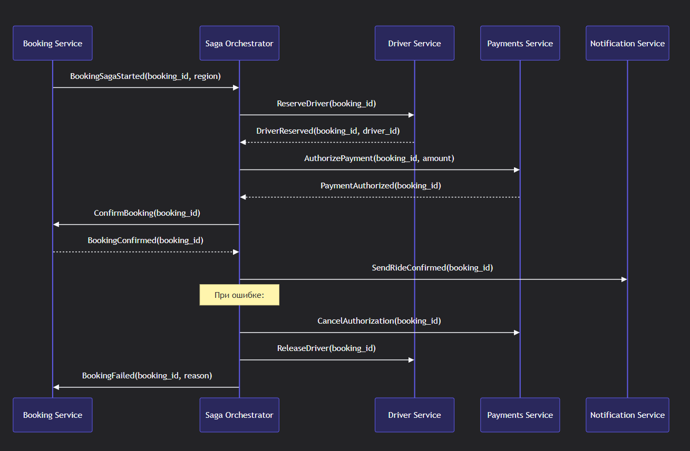
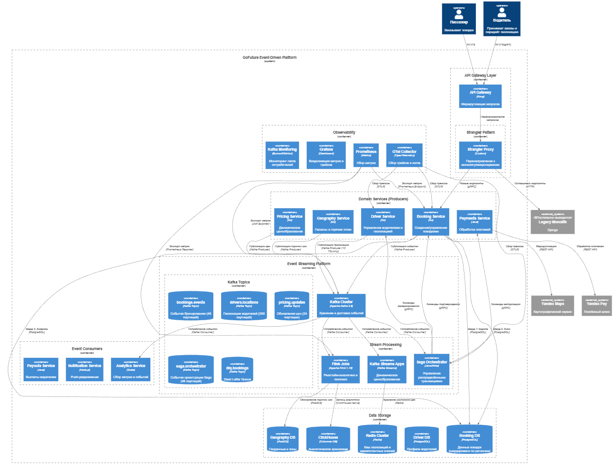

## Модель доменных событий

| Категория | Событие | Источник | Потребители | Ключ партиционирования |
| --- | --- | --- | --- | --- |
| Бронирование | BookingCreated | booking-service | pricing, driver, fraud, analytics | region_id |
|  | BookingCancelled | booking-service | driver, payouts, analytics | region_id |
|  | BookingCompleted | booking-service | payments, payouts, analytics | region_id |
| Водители | DriverLocationUpdated | driver-service | geography, booking, analytics | driver_id |
|  | DriverStatusChanged | driver-service | booking, geography, analytics | region_id |
| Ценообразование | PriceCalculated | pricing-service | booking, analytics | region_id |
|  | SurgeMultiplierUpdated | pricing-service | booking, driver-app, analytics | zone_id |
| Платежи | PaymentProcessed | payments-service | booking, fraud, analytics | booking_id |
| География | HotspotDetected | geography-service | pricing, driver-app, analytics | zone_id |
|  | TrafficConditionUpdated | geography-service | booking, pricing, analytics | region_id |
| Saga-транзакции | BookingSagaStarted | booking-service | Orchestrator | booking_id |
|  | DriverAssigned | driver-service | Orchestrator | booking_id |
|  | PaymentAuthorized | payments-service | Orchestrator | booking_id |
|  | BookingConfirmed | Orchestrator | booking-service, notification | booking_id |
|  | BookingCompensated | Orchestrator | driver-service, payments-service | booking_id |

## Схема топиков Kafka с партиционированием

| Топик | Партиции | Репликация | Стратегия партиционирования | Хранение |
| --- | --- | --- | --- | --- |
| bookings.events | 48 (16 × 3 региона) | 3 | region_id (0-15: Европа, 16-31: Азия, 32-47: Америка) | 7 дней |
| drivers.locations | 200 (по 50 на регион) | 3 | driver_id % 50 + region_offset | 1 час (hot data) |
| pricing.updates | 24 (8 × 3 региона) | 3 | zone_id % 8 + region_offset | 24 часа |
| saga.orchestrator | 48 | 3 | booking_id (consistent hashing) | 30 дней (для отладки) |
| analytics.events | 96 | 2 | event_type (равномерное распределение) | 90 дней |
| dlq.bookings | 12 | 3 | error_type | 30 дней |

Обоснование партиционирования:
- Региональное партиционирование для bookings.events - изолирует нагрузку по регионам, позволяет независимо масштабировать обработку
- Высокая гранулярность для геолокации (drivers.locations) - 200 партиций для 500К водителей обеспечивает ~2500 водителей/партицию, что оптимально для геопоиска
- Согласованность для Saga - партиционирование по booking_id гарантирует упорядоченную обработку всех событий одной транзакции

## Потребители событий: выбор технологий

| Сценарий обработки | Технология | Обоснование |
| --- | --- | --- |
| Реалтайм-геопоиск | Flink | <br> Stateful processing для оконных агрегаций (горячие зоны)<br> Exactly-once semantics для точного расчёта плотности водителей<br> Low-latency (< 100 мс) для мгновенного обновления цены |
| Динамическое ценообразование | Kafka Streams | <br> Лёгкий старт (встраивается в сервис)<br> KTable для хранения состояния зон и мультипликаторов<br> Interactive Queries для получения текущего мультипликатора из pricing-service |
| Saga-оркестрация | Специализированный оркестратор | <br> Централизованный сервис на Java с акторной моделью (Akka)<br> Хранение состояния в saga.orchestrator топике + снапшоты в БД |
| Аналитика в реальном времени | Flink | <br> Сложные оконные агрегации (скользящее среднее спроса)<br> ML-инференс через пользовательские функции (прогноз спроса)<br> Sink в ClickHouse для аналитических дашбордов |

## Паттерн Saga для распределённых транзакций

Выбран: Orchestrated Saga

Обоснование выбора:
- Сложность логики: централизованная в оркестраторе, легче отладить и модифицировать
- Мониторинг: единая точка для мониторинга в оркестраторе, критично для 500К поездок
- Изменение оркестрации: изменение только оркестратора, быстрое внедрение новых шагов
- Отказоустойчивость: оркестратор может быть шардирован по booking_id, предсказуемое поведение при сбоях

Пример саги для создания поездки: 
```
sequenceDiagram
    participant B as Booking Service
    participant O as Saga Orchestrator
    participant D as Driver Service
    participant P as Payments Service
    participant N as Notification Service
    
    B->>O: BookingSagaStarted(booking_id, region)
    O->>D: ReserveDriver(booking_id)
    D-->>O: DriverReserved(booking_id, driver_id)
    O->>P: AuthorizePayment(booking_id, amount)
    P-->>O: PaymentAuthorized(booking_id)
    O->>B: ConfirmBooking(booking_id)
    B-->>O: BookingConfirmed(booking_id)
    O->>N: SendRideConfirmed(booking_id)
    
    Note over O: При ошибке:
    O->>P: CancelAuthorization(booking_id)
    O->>D: ReleaseDriver(booking_id)
    O->>B: BookingFailed(booking_id, reason)
```


Компенсирующие действия:    
| Шаг | Компенсация | Идемпотентность |
| --- | --- | --- |
| ReserveDriver | ReleaseDriver |  Проверка статуса водителя перед освобождением |
| AuthorizePayment | CancelAuthorization |  Идемпотентный ключ booking_id + attempt_id |
| ConfirmBooking | CancelBooking |  Версионирование состояния поездки |

## Механизмы надёжной доставки

| Механизм | Реализация | Гарантия |
| --- | --- | --- |
| Идемпотентность | Идемпотентные ключи в заголовках событий (X-Idempotency-Key)<br> Deduplication через booking_id + event_type + version в Redis | Exactly-once на уровне бизнес-логики |
| Повторные попытки | Экспоненциальная задержка (1с → 2с → 4с → 8с)<br> Circuit breaker после 5 неудачных попыток | Защита от каскадных отказов |
| Dead Letter Queue | Автоматическая маршрутизация в dlq.bookings после 10 попыток<br> UI для ручной обработки ошибок | Не теряем события при постоянных сбоях |
| Снапшоты состояния | Периодические снапшоты оркестратора в saga.snapshots топике (каждые 5 событий)<br> Восстановление из последнего снапшота + репроцессинг | Быстрое восстановление после сбоя оркестратора |
| Гарантия упорядоченности |  Партиционирование по booking_id<br> Single-writer per partition в сервисах | События одной поездки обрабатываются строго по порядку |

## Диаграмма C2: Событийная платформа GoFuture 



## Мониторинг

Ключевые принципы мониторинга:

- Наблюдаемость «из коробки»
  - Все сервисы экспортируют метрики через OpenTelemetry Collector
- Корреляция событий
  - Единый trace_id для всей цепочки обработки события (от публикации до потребления)
- Прогнозирование проблем
  - Машинное обучение на метриках для предсказания лагов потребителей до их возникновения
- Бизнес-метрики в реальном времени
  - Агрегация событий в Flink для расчёта KPI (конверсия, среднее время назначения водителя)

## Мониторинг Event-Driven архитектуры

### Обоснование подхода к мониторингу

Проблемы мониторинга EDA:

- Асинхронность: события обрабатываются асинхронно, сложнее отследить полный путь запроса
- Распределенность: события проходят через несколько сервисов и топиков Kafka
- Задержки: важно отслеживать задержки между публикацией и обработкой событий
- Порядок обработки: необходимо гарантировать порядок обработки событий в партициях
- Надежность: критично отслеживать потери событий, дубликаты, события в DLQ

Мониторинг должен обеспечивать:

- Наблюдаемость: понимание состояния системы в реальном времени
- Проактивность: обнаружение проблем до их влияния на пользователей
- Быстрое восстановление: быстрая диагностика и решение проблем

### Выбранные инструменты мониторинга

| Инструмент | Назначение | Интеграция в архитектуру |
| --- | --- | --- |
| Prometheus | Сбор и хранение метрик |  Экспорт через /metrics эндпоинт в каждом сервисе JMX Exporter для Kafka и Flink |
| Grafana | Визуализация и алертинг |  Дашборды по регионам и типам событий Алерты через Alertmanager → Slack/PagerDuty |
| OpenTelemetry Collector | Единая точка сбора трейсов и логов |  Приём через OTLP протокол от всех сервисов Экспорт в Jaeger (трейсы) и Loki (логи) |
| Jaeger | Анализ распределённых трейсов |  Корреляция событий по trace_id от публикации до потребления |
| Loki | Лог-агрегация |  Структурированные логи в формате JSON с полями booking_id, region_id |
| Burrow/KMinion | Мониторинг лагов Kafka |  Интеграция с Prometheus для алертинга по лагам потребителей |
| Kafka Lag Exporter | Детальный мониторинг лагов |  Экспорт лагов по партициям в Prometheus |
| Flink Metrics Reporter | Мониторинг стриминг-джобов |  Экспорт метрик задержки и пропускной способности в Prometheus |
