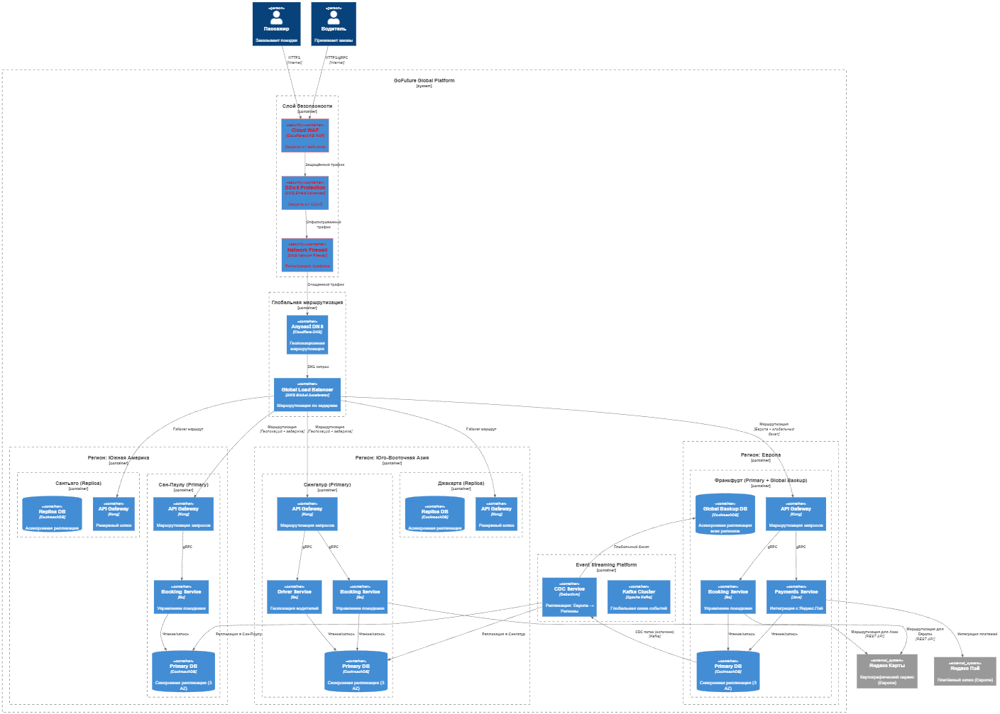

## Схема геомаршрутизации 

## Обоснование выбора регионов

| Регион | Провайдер | Зона доступности | Обоснование | Покрываемые рынки |
| --- | --- | --- | --- | --- |
| Франкфурт (Европа) | AWS (eu-central-1) | 3 AZ | Исторический рынок GoFuture (Россия/СНГ + ЕС), интеграция с Яндекс.Картами/Пэй, соответствие GDPR | Россия, СНГ, ЕС, Турция |
| Сингапур | AWS (ap-southeast-1) | 3 AZ | Центр ЮВА, низкая задержка (<30 мс) для 80% пользователей региона | Сингапур, Малайзия, Таиланд, Вьетнам |
| Джакарта | GCP (asia-southeast2) | 3 AZ | Покрытие Индонезии (крупнейший рынок ЮВА) | Индонезия, Филиппины |
| Сан-Паулу | AWS (sa-east-1) | 3 AZ | Крупнейший рынок Латинской Америки | Бразилия, Парагвай, Уругвай |
| Сантьяго | Azure (southcentralus) | 3 AZ | Покрытие Андских стран, резерв для Южной Америки | Чили, Аргентина, Перу |
| Франкфурт (Глобальный бэкап) | AWS (eu-central-1) | 3 AZ | Основной регион как глобальный бэкап (минимальная задержка для межрегиональной репликации) | Резерв для всех регионов |

## Аварийное переключение

- Европа - исторический рынок с интеграцией Яндекс.Карт/Пэй
- Глобальный бэкап в Европе - минимальная задержка для репликации
- Направление репликации - Европа → регионы, т.к. Европа - источник истины для финансовых данных
- Интеграции с Яндекс - привязаны к европейскому региону

## Таблица сценариев отказа

| Сценарий отказа | Вероятность | Влияние | Механизм обнаружения | Действия по восстановлению | Время восстановления |
| --- | --- | --- | --- | --- | --- |
| Отказ региона в ЮВА | Средняя | Высокий | Global Accelerator health checks | Переключение трафика в Европу (режим только чтение) + уведомление команды | < 2 минуты |
| Отказ региона в ЮА | Средняя | Высокий | Global Accelerator health checks | Переключение трафика в Европу (режим только чтение) + уведомление команды | < 2 минуты |
| Отказ европейского региона | Низкая | Критический | Внешний мониторинг (Pingdom) | Активация глобального бэкапа в Франкфурте (вторая зона) + ручное переключение платежных шлюзов | < 5 минут |
| Потеря данных в регионе | Низкая | Критический | Мониторинг репликации | Восстановление из европейского глобального бэкапа | < 15 минут |
| Сбой интеграции Яндекс.Пэй | Средняя | Высокий | Мониторинг платежных шлюзов | Переключение на резервный платёжный шлюз (локальный для региона) | < 1 минута |